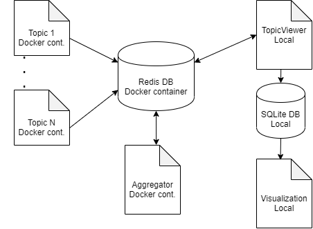

# TopicViewer

Tool to visualize how often given keywords appear in Twitter.

## Requirements

- **Twitter API**: You need to create an account, and store the following credentials in the topic folder:
    ```
        {
            "consumer_key": "",
            "consumer_secret": "",
            "access_token_key": "",
            "access_token_secret": ""
        }
    ```
- **Docker**: three kinds of containers are run:
    1. One that holds the Redis database, which I will describe later.
    2. One per topic, listening to a twitter stream and storing values in Redis.
    3. An aggregator script, that aggregates the topic occurrences per unit time (default one minute).

- **Redis image**: retrieved with `docker pull redis`


## How it works

In the main function of `topic_viewer.py`, you write the topics you want to track. The viewer will then
run the redis image, initializing the database, one container per topic, each listening to a twitter stream,
and a container with the aggregation script, which aggregates topic occurrences. 

All containers communicate through Redis, which consists of three databases:
1. Database 0, called `topic`: here is where the topic containers publish the timestamps of the occurrences
of the topic they are listening to.
2. Database 1, called `agg`: here is where the aggregator script writes the aggregated values per time unit,
which then the viewer persists in a SQLite database.
3. Database 2, called `activity`: used by the viewer to monitor the activity of each group. Once a group has not
received any new occurrences in the last three checks, it is removed from Redis. A check is performed every time
a new group is created.

The TopicViewer persists the topic counts per unit time in a SQLite database, which is then accessed by `vis.py`,
to plot the topic counts.

